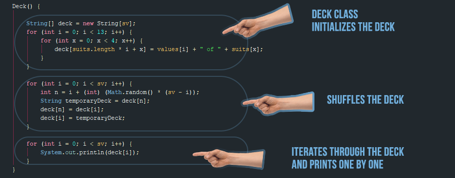
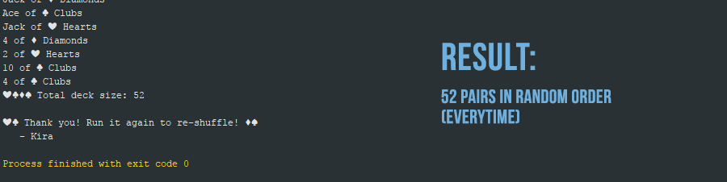
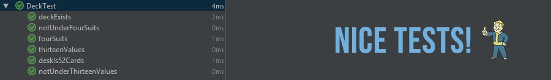

# shuffleDeck

🃏━━━━━━━━━━━━━━━━━

#### February, 16, 2018
#### By `Kira Loo`
🃏━━━━━━━━━━━━━━━━━

## Description
🃏━━━━━━━━━━━━━━━━━

_Quick shuffling deck app for you cool folks at 🚚 , Enjoy!!_  

## Setup/Installation Requirements
🃏━━━━━━━━━━━━━━━━━

You will need IntelliJ, and Java (JDM+SDK) installed on your device.

* ->🃏 Clone the repo from git hub.
* ->🃏 Open in your favorite editor, (IntelliJ.)
* ->🃏 Run it
* ->🃏 Nice cards ~

## Technologies Used
🃏━━━━━━━━━━━━━━━━━

* _Atom_
* _IntelliJ IDEA_
* _Adobe Photoshop_

### License & Contact
🃏━━━━━━━━━━━━━━━━━
Copyright &copy; 2017 _Kira Loo_

http://www.kizxm.com
kizxm@yahoo.com
